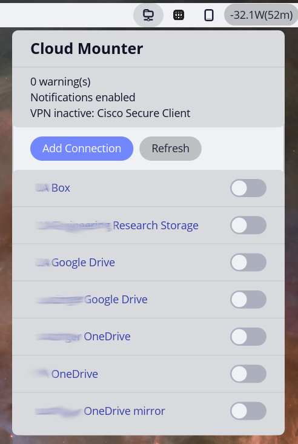
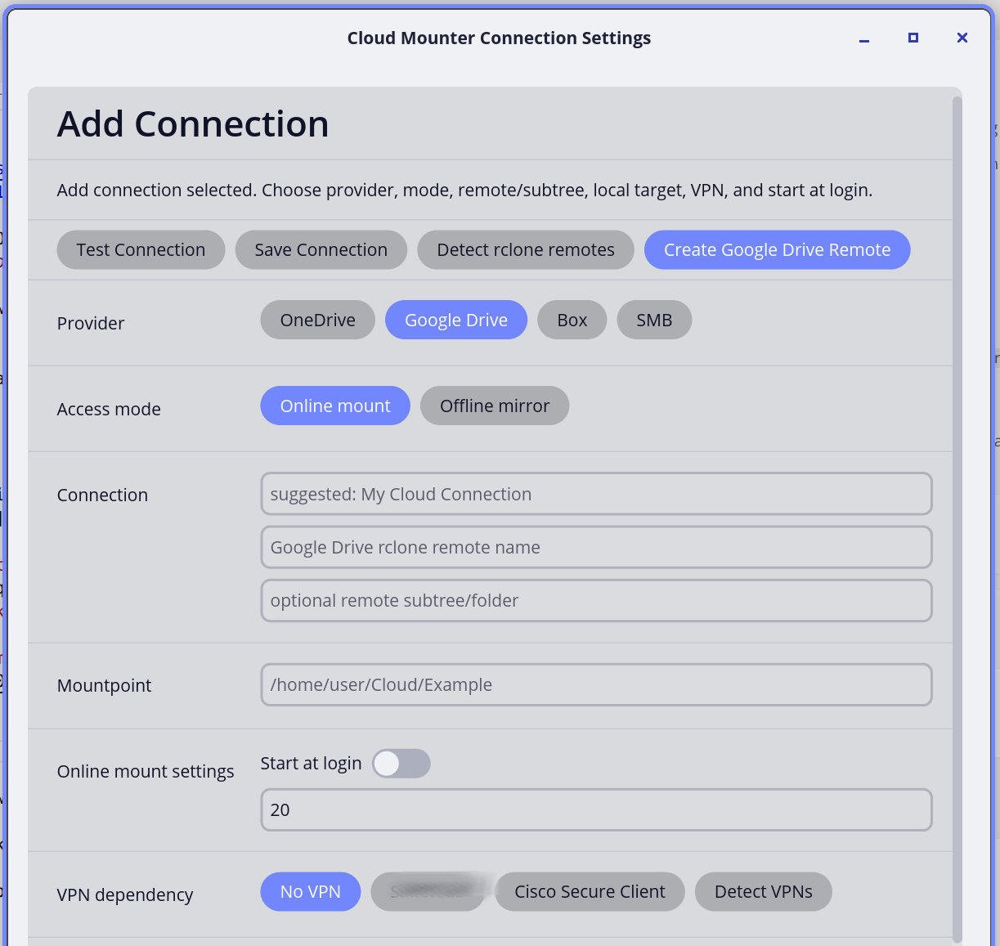
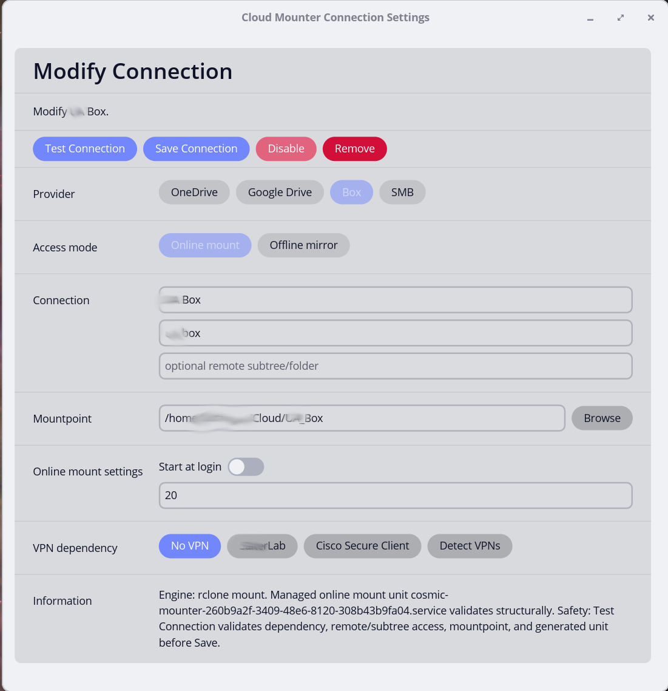

# COSMIC Cloud Mounter


COSMIC Cloud Mounter is a COSMIC desktop applet for managing storage
connections to **OneDrive**, **Google Drive**, **Box**, and **SMB**. It supports
direct **Online mount** and **Offline mirror** modes with background
synchronization.

The applet simplifies mounting cloud storage. Users can turn storage
connections on or off to reduce file manager stalls when the network is slow or
unavailable.

## Modes and Providers

**Online mount** uses a network-backed FUSE filesystem. It is useful for browsing
large remote trees without keeping a full local copy.

**Offline mirror** uses an ordinary local directory plus bidirectional sync.
Automatic background sync pauses on metered networks by default.

The following connection engines are used to connect to the providers:

| Provider | Online mount | Offline mirror |
|---|---|---|
| OneDrive | [`jstaf/onedriver`](https://github.com/jstaf/onedriver) | [`abraunegg/onedrive`](https://github.com/abraunegg/onedrive) |
| Google Drive | [`rclone mount`](https://rclone.org/) | [`rclone bisync`](https://rclone.org/) |
| Box | `rclone mount` | `rclone bisync` |
| SMB | `rclone mount` | `rclone bisync` |

Example screenshots of the applet:
<table>
  <tr>
    <td valign="top"></td>
    <td valign="top"></td>
    <td valign="top"></td>
  </tr>
</table>

## Installation and Removal

Before installing, verify dependencies in
[Dependency Installation.md](Dependency%20Installation.md). Follow instructions to install the
external storage engines you plan to use.

### Installation from Source

See [Build from Source](#build-from-source).

### Installation from Debian Package

The [latest GitHub release](https://github.com/uutzinger/cosmic-ext-applet-mounter/releases/latest)
provides an `amd64` Debian package:

```sh
wget https://github.com/uutzinger/cosmic-ext-applet-mounter/releases/download/v0.4.2/cosmic-ext-applet-mounter_0.4.2_amd64.deb
sudo apt install ./cosmic-ext-applet-mounter_0.4.2_amd64.deb
```

The package installs the applet binary, OneDrive authentication helper, desktop
entry, AppStream metadata, and icon.

### Installation from Flatpak

Flatpak packaging is being prepared for COSMIC repository submission. Until it
is published through a public Flatpak remote, use the Debian package or build
from source unless you are testing the Flatpak manifest locally.

### Post Installation

After installation, open **COSMIC Settings > Desktop > Panel > Applets** and add
**COSMIC Cloud Mounter** to the desired panel or dock.

### Uninstallation

Before uninstalling, use the applet to stop active mounts and mirrors. If you
also want to remove its generated user services and timers, remove each
connection from the applet first. Removing a connection does not delete cloud
data, local mirror data, provider credentials, caches, or recovery directories.

Remove COSMIC Cloud Mounter from the panel, then uninstall the package:

When installed from Debian package:

```sh
sudo apt remove cosmic-ext-applet-mounter
```

When installed from Flatpak:

```sh
flatpak uninstall io.github.uutzinger.cosmic-ext-applet-mounter
```

When installed from source with `just install-user`, remove the installed user
files:

```sh
rm -f ~/.local/bin/cosmic-ext-applet-mounter
rm -f ~/.local/bin/cosmic-ext-applet-mounter-onedrive-auth-helper
rm -f ~/.local/share/applications/io.github.uutzinger.cosmic-ext-applet-mounter.desktop
rm -f ~/.local/share/metainfo/io.github.uutzinger.cosmic-ext-applet-mounter.metainfo.xml
rm -f ~/.local/share/icons/hicolor/scalable/apps/io.github.uutzinger.cosmic-ext-applet-mounter.svg
update-desktop-database ~/.local/share/applications 2>/dev/null || true
gtk-update-icon-cache -f -t ~/.local/share/icons/hicolor 2>/dev/null || true
```

Package removal does not delete configuration and data in the user's home
directory. Any connection records or generated user services not removed
before uninstalling remain in place for a later reinstall or manual cleanup.

## Data Integrity Warning

Cloud sync and mounts can delete, overwrite, duplicate, or hide files when they
are configured incorrectly. **Before testing with important data, make an
independent backup**.

To reduce data integrity risks, **do not**:

- configure Online mount and Offline mirror simultaneously for the same
  provider account and overlapping remote subtree;
- use an Online mount point as an Offline mirror directory;
- use an Offline mirror directory as an Online mount point;
- run OneDrive Online mount and OneDrive Offline mirror concurrently against the
  same OneDrive account or overlapping subtree unless the applet has explicitly
  isolated that setup;
- run `onedrive --resync` casually. State rebuilds require preview and
  confirmation when managed by the applet.

Offline **mirror** mode is the reliable option for uninterrupted local file
access. Online mounts can block or fail when the provider, VPN, FUSE layer, or
network stalls.

## Applet Workflow

The panel popup shows active connection count, notification
state, VPN summary, `Add Connection`, `Refresh`, and a scrollable list of
connections.

Each connection row has the connection name and one primary state control:

- Online mount toggle button uses Mount or Unmount.
- Offline mirror toggle button uses Start or Stop for background synchronization.

Clicking the connection name opens `Modify`.

`Add` and `Modify` share the same editor. Modify mode exposes
`Test Connection`, `Save Connection`, `Preview` and `Sync Now` for Offline
mirrors, `Disable` or `Enable`, and `Remove`. The Information section
summarizes the selected engine, generated unit validation, and confirmation
policy.

## Authentication

The applet does not store provider credentials. Credentials stay with `rclone`,
`jstaf/onedriver`, `abraunegg/onedrive`, or the operating system.

For Google Drive and Box, applet-driven setup delegates browser OAuth to
`rclone`. For SMB, the password remains in rclone's credential mechanism, not
in applet configuration.

For OneDrive Online mount, the applet uses `jstaf/onedriver` with applet-owned
configuration and cache paths. For OneDrive Offline mirror, it uses
`abraunegg/onedrive` with applet-owned configuration, sync, and recovery paths.

## Conflict Recovery and Limitations

Offline mirrors preserve both versions of same-file conflicts. Deletions
propagate bidirectionally after preview and confirmation policy has been
satisfied. Deleted and overwritten files are moved into recovery locations and
retained by applet policy for 30 days.

Recovery retention is not a backup system.

Google Docs, Sheets, Slides, and related browser-native Google document types
are excluded from rclone Offline mirrors and remain browser-accessible.

Known limitations:

- OneDrive Offline mirror setup uses `abraunegg/onedrive` authentication. The
  applet provides a helper flow for the Microsoft redirect and retains a manual
  handoff fallback because redirect handling can vary by browser and account
  type.
- Google Drive Online mount testing can hit Google Drive API quota/rate
  limiting.
- NetworkManager support currently uses fixed `nmcli` commands; direct D-Bus
  integration remains future work.

## VPN Integration

The applet can associate a connection with a NetworkManager VPN profile or
Cisco Secure Client dependency. VPN profiles and credentials are configured
outside the applet.

The applet may start a VPN dependency and wait for readiness checks before
mounting or syncing. It disconnects only a VPN it activated, and only after no
active connection still requires it.

## Connection Removal

Press **Remove** once to request confirmation, then press **Confirm Remove**
again to remove the connection.

Removal deletes the applet-managed connection record and any matching
applet-owned systemd user units. Units that do not carry this applet's ownership
marker for the selected connection are treated as external and are left
untouched. If `systemctl --user daemon-reload` fails, the unit file is restored
to avoid an inconsistent service state.

Connection removal does **not** delete provider credentials, cloud data, local
mirror data, caches, recovery directories, or original imported legacy service
files.

Unused rclone remotes can be removed separately from the Add Connection rclone
management area. That action requires confirmation and changes rclone
configuration, not only applet configuration.

## Build from Source

Requirements:

- Linux with the COSMIC desktop
- Rust 1.95.0 or later through rustup
- `just`
- native development packages required by libcosmic

The repository pins the Rust toolchain and libcosmic Git revision.

Common commands:

```sh
just fmt
just check
just lint
just test
just metadata-check
just verify
just run
just stage
just install-user
just deb
```

Useful read-only examples:

`cargo run --example dependency_inventory` checks dependencies.

`just install-user` installs the development build under `~/.local` and
updates desktop metadata and icons for the current user.

`just stage` installs into `target/stage/usr` and does not modify the host
system.

`just metadata-check` validates the desktop entry and AppStream metadata without
network access. Because the official COSMIC applet template currently uses
COSMIC-specific metadata fields that strict freedesktop validators report as
invalid or unknown, `just metadata-check` is non-fatal; use
`just metadata-check-strict` to see the raw validator result. `just
metadata-check-net` additionally checks published URLs and screenshots. `just
deb` builds a local unsigned Debian binary package in the parent directory.

## Flatpak Packaging and Publication

Flatpak packaging is intended for the COSMIC Flatpak repository because this is
a COSMIC panel applet, not a general desktop application. The local Flatpak has
been built, installed, tested from a local repository, and verified for
AppStream discovery and uninstall behavior. It is not yet published through a
public COSMIC remote.

The project-owned manifest is:

```text
packaging/flatpak/io.github.uutzinger.cosmic-ext-applet-mounter.json
```

The manifest builds from the tagged source release and generated Cargo source
list. The COSMIC repository submission uses the `pop-os/cosmic-flatpak`
workflow:

```sh
cd ../cosmic-flatpak
just build io.github.uutzinger.cosmic-ext-applet-mounter
just build-changed
flatpak build-update-repo --generate-static-deltas --prune repo
```

The final manifest uses `flatpak-spawn --host` for approved host commands, so
host dependencies still must be installed separately: `rclone`, `onedriver`,
`onedrive`, `fusermount3`, `nmcli`, and any VPN clients used by configured
connections.

The tested Flatpak design does **not** require `--filesystem=host`. It uses
narrow app-specific grants for:

- native-visible COSMIC applet configuration;
- app-owned engine configuration/cache/state;
- generated user systemd units;
- host COSMIC theme files for standalone settings windows.

Existing native/source/Debian applet configuration is shared with the Flatpak
prototype through:

```text
~/.config/cosmic/io.github.uutzinger.cosmic-ext-applet-mounter/v2/document
```

**Do not** run native and Flatpak instances at the same time. Both can see the same
connection configuration and manage the same generated user services, so
concurrent instances can race on mount, sync, and service state. Switching
package formats should be done by stopping the running applet first, then
starting the other package format.

To regenerate the reproducible Flatpak source list after dependency changes:

```sh
just flatpak-cargo-sources
```

This requires `flatpak-cargo-generator` or the equivalent COSMIC helper script
and writes `packaging/flatpak/cargo-sources.json`. For public release, submit a
focused pull request to `pop-os/cosmic-flatpak` containing the manifest and
generated source list. The repository builds binaries from source; maintainers
do not need prebuilt `amd64` binaries from this project.

## Project Development

This applet was developed with agent-assisted programming. The project starts
from [Applet Description.md](Applet%20Description.md), which is translated into
[Requirements and Specifications.md](Requirements%20and%20Specifications.md),
including the Functional Requirements. The author reviews these documents before
implementation. The requirements drive [Task List.md](Task%20List.md), and its
execution history is documented in
[Task List Completion Notes.md](Task%20List%20Completion%20Notes.md). The author
supervises and approves each task and its verification.

## Contributing & Feature Requests

### Feature Requests

You can implement additional features using agent-assisted programming. OpenAI Codex was used for the current version:

- Clone the GitHub repository.
- Update the Applet Description to include your request, or create a document
  describing your request and ask your AI agent to include it in the Applet
  Description.
- Have your AI agent check and update the Applet Description.
- Have your AI agent update the Requirements and Specifications based on the Applet Description.
- Verify the modifications to the Requirements and Specifications.
- Ask your AI agent to update the Functional Requirements based on your reviewed Requirements and Specifications.
- Have your AI agent add Tasks to the Task list based on the updated Specifications.
- Have your AI agent execute the additions to the Task list.
- Make sure your AI agent updates Task List Completion Notes.
- Complete the verifications and test for your implementation as instructed by your AI agent. Do not skip the testing.
- Submit a pull request to this repo.

### Bug Reports

- Submit a report on GitHub.

## License

MIT, copyright Urs Utzinger and OpenAI Codex.
