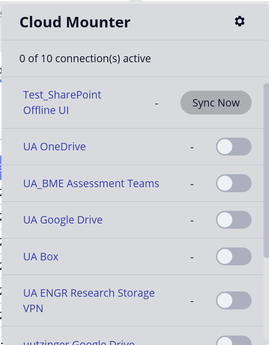
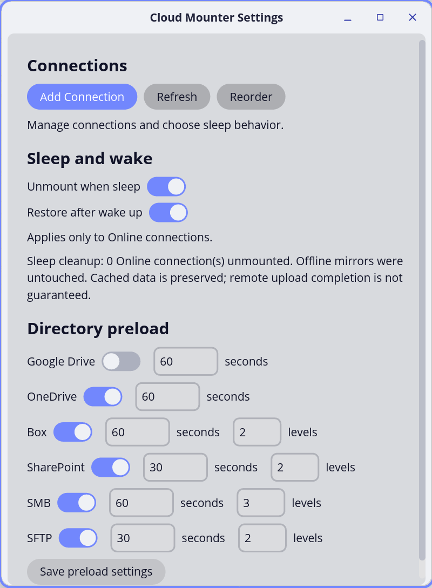
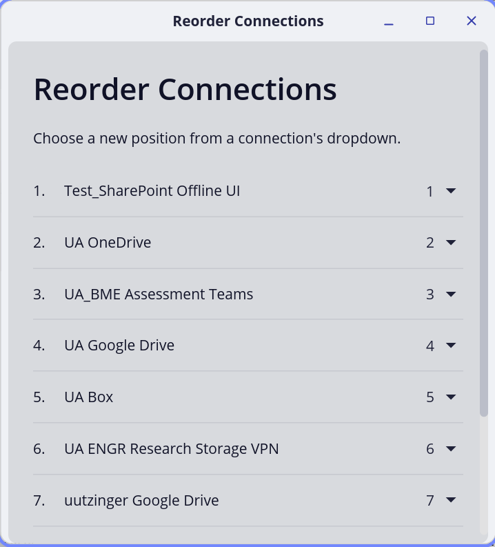
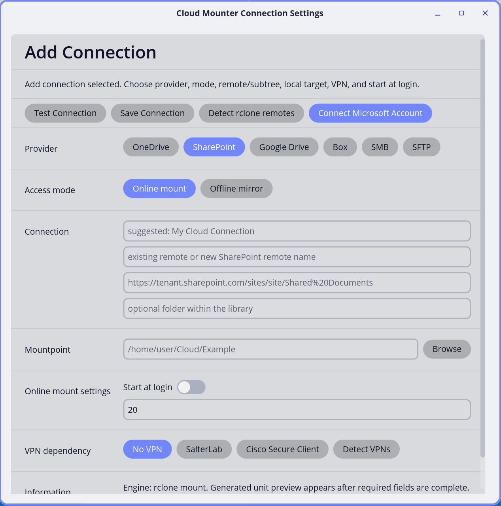
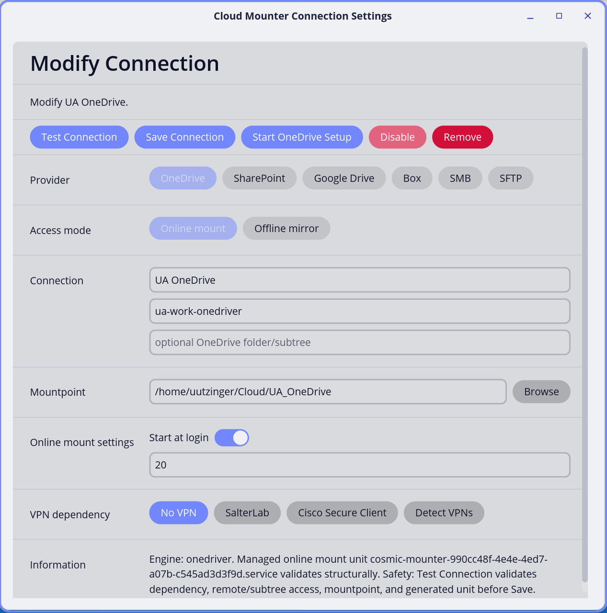

# Cloud Mounter for COSMIC™


Cloud Mounter is an applet for the COSMIC™ desktop for managing storage
connections to **OneDrive**, **SharePoint**, **Google Drive**, **Box**, **SMB**, and **SFTP**. It supports
direct **Online mount** and **Offline mirror** modes.

The applet simplifies mounting cloud storage. Users can turn storage
connections on or off to reduce file manager stalls when the network is slow or
unavailable. The applet attempts to pre-cache directory metadata when available.

## Table of Contents

- [Modes and Providers](#modes-and-providers)
- [Installation and Removal](#installation-and-removal)
  - [Dependencies](#dependencies)
  - [Installation from Source](#installation-from-source)
  - [Installation from Debian Package](#installation-from-debian-package)
  - [Installation from Flatpak](#installation-from-flatpak)
  - [Post Installation](#post-installation)
  - [Uninstallation](#uninstallation)
- [Data Integrity Warning](#data-integrity-warning)
- [Applet Workflow](#applet-workflow)
- [Settings](#settings)
- [Authentication](#authentication)
- [Conflict Recovery and Limitations](#conflict-recovery-and-limitations)
- [VPN Integration](#vpn-integration)
- [Connection Removal](#connection-removal)
- [Project Development](#project-development)
- [Contributing & Feature Requests](#contributing--feature-requests)
  - [Feature Requests](#feature-requests)
  - [Bug Reports](#bug-reports)
- [License](#license)
- [Appendix](#appendix)
  - [Build from Source](#build-from-source)
  - [Flatpak Packaging and Publication](#flatpak-packaging-and-publication)

## Modes and Providers

Each connection can be configured for either **Online mount** or **Offline mirror** mode.

**Online mount** uses a network-backed FUSE filesystem. It is useful for browsing
large remote trees without keeping a full local copy. **Offline mirror** uses an ordinary local directory plus bidirectional background sync.

Example screenshots of the applet and its separate windows:

<table>
  <tr>
    <td><a href="./resources/Popup.png" target="_blank" rel="noopener noreferrer"></a></td>
    <td>
    <a href="./resources/Settings.png" target="_blank" rel="noopener noreferrer"></a>
    <a href="./resources/Reorder_Connections.png" target="_blank" rel="noopener noreferrer"></a>
    </td>
  </tr>
  <tr>
    <td><a href="./resources/Add_Connection.png" target="_blank" rel="noopener noreferrer"></a></td>
    <td><a href="./resources/Change_Connection.png" target="_blank" rel="noopener noreferrer"></a></td>
  </tr>
</table>

The following connection engines are used to connect to the providers:

| Provider | Online mount | Offline mirror |
|---|---|---|
| OneDrive | [`jstaf/onedriver`](https://github.com/jstaf/onedriver) | [`abraunegg/onedrive`](https://github.com/abraunegg/onedrive) |
| Google Drive | [`rclone mount`](https://rclone.org/) | [`rclone bisync`](https://rclone.org/) |
| Box | `rclone mount` | `rclone bisync` |
| SMB | `rclone mount` | `rclone bisync` |
| SFTP | `rclone mount` | `rclone bisync` |
| SharePoint | `rclone mount` | managed `rclone bisync` schedule, disabled until explicitly started |

Rclone handles most providers. OneDrive Online mount uses `jstaf/onedriver` for
on-demand access, while OneDrive Offline mirror uses `abraunegg/onedrive` to monitor a
local synchronized copy instead of running periodic `rclone bisync` jobs.
Microsoft 365 tenants may require [administrator consent](https://github.com/abraunegg/onedrive/blob/master/docs/usage.md#business--enterprise-authentication-and-admin-consent)
for `abraunegg/onedrive`.

## Data Integrity Warning

Cloud sync and mounts can delete, overwrite, duplicate, or hide files when they
are configured incorrectly. **Before testing with important data, make an
independent backup**.

To reduce data integrity risks, **do not**:

- configure Online mount and Offline mirror simultaneously for the same
  provider account and overlapping remote subtree;
- use an Online mount point as an Offline mirror directory;
- use an Offline mirror directory as an Online mount point;
- run OneDrive Online mount and OneDrive Offline mirror concurrently against the
  same OneDrive account or overlapping subtree unless the applet has explicitly
  isolated that setup;
- run `rclone mount`, `rclone bisync`, `onedriver`, `onedrive --sync`, or
  `onedrive --resync` directly against an applet-managed connection. Use the
  applet's Mount, Unmount, Preview, Sync Now, Start, Stop, and repair controls so
  its safety checks and synchronization state remain consistent.

Offline **mirror** mode is the reliable option for uninterrupted local file
access. Online mounts can block or fail when the provider, VPN, FUSE layer, or
network stalls, resulting in file manager hangs.

## Installation and Removal

### Dependencies

For simple installation of dependencies run the automated installer:

```sh
curl -fsSL https://raw.githubusercontent.com/uutzinger/cosmic-ext-applet-mounter/main/scripts/install-dependencies.sh | bash
```

You can also verify dependencies in [Dependency Installation.md](Dependency%20Installation.md).  The applet itself does not install the dependencies for you.

### Installation from Source

See [Build from Source](#build-from-source) below.

### Installation from Debian Package

The [latest GitHub release](https://github.com/uutzinger/cosmic-ext-applet-mounter/releases/latest)
provides native `amd64` and `arm64` Debian packages for Ubuntu 22.04, 24.04,
and 26.04. For example, on Ubuntu or Pop!_OS 24.04 amd64:

```sh
wget https://github.com/uutzinger/cosmic-ext-applet-mounter/releases/download/v0.5.2/cosmic-ext-applet-mounter_0.5.2_ubuntu24.04_amd64.deb
sudo apt install ./cosmic-ext-applet-mounter_0.5.2_ubuntu24.04_amd64.deb
```

The package installs the applet binary, OneDrive authentication helper, desktop
entry, AppStream metadata, and icon.

### Installation from Flatpak

Flatpak packaging is being prepared for COSMIC repository submission. Until it is published through a public Flatpak remote, use the Debian package or build from source unless you are testing the Flatpak manifest locally.

### Post Installation

After installation, open **COSMIC Settings > Desktop > Panel > Applets** and add
**Cloud Mounter** to the desired panel or dock.

### Uninstallation

Before uninstalling, use the applet to stop active mounts and mirrors. If you
also want to remove its generated user services and timers, remove each
connection from the applet first. Removing a connection does not delete cloud
data, local mirror data, provider credentials, caches, or recovery directories.

Remove Cloud Mounter from the panel, then uninstall the package:

When installed from Debian package:

```sh
sudo apt remove cosmic-ext-applet-mounter
```

When installed from Flatpak:

```sh
flatpak uninstall io.github.uutzinger.cosmic-ext-applet-mounter
```

When installed from source with `just install-user`, remove the installed user
files:

```sh
rm -f ~/.local/bin/cosmic-ext-applet-mounter
rm -f ~/.local/bin/cosmic-ext-applet-mounter-onedrive-auth-helper
rm -f ~/.local/share/applications/io.github.uutzinger.cosmic-ext-applet-mounter.desktop
rm -f ~/.local/share/metainfo/io.github.uutzinger.cosmic-ext-applet-mounter.metainfo.xml
rm -f ~/.local/share/icons/hicolor/scalable/apps/io.github.uutzinger.cosmic-ext-applet-mounter.svg
update-desktop-database ~/.local/share/applications 2>/dev/null || true
gtk-update-icon-cache -f -t ~/.local/share/icons/hicolor 2>/dev/null || true
```

Package removal does not delete configuration and data in the user's home
directory. Any connection records or generated user services not removed
before uninstalling remain in place for a later reinstall or manual cleanup.

## Applet Workflow

The panel popup shows a scrollable list of connections and a brief status line
when attention is needed.

Each connection row has the connection name and one primary state control:

- Online mount toggle button uses Mount or Unmount.
- Offline mirror toggle button uses Start or Stop for background synchronization.

Clicking the connection name opens `Modify` window.

The connection mounting state is persistent over login: An Online mount left
on is remounted at the next login; switching it off unmounts it and keeps it off
after reboot. Offline mirror Start and Stop likewise enable or disable the
background schedule across logins.

A small count beside the name shows pending work when an engine can estimate it;
`+` means active without a count and `-` means unknown or unavailable.

## Settings

Open the Settings window by clicking the gear icon. `Add Connection`, `Refresh`,
and `Reorder` are available under **Connections**. Add and Modify connections
share the same editor.

Add mode exposes `Test Connection`, `Save Connection`, `Import`, and the
provider-specific setup and rclone remote-management actions needed to create
or select a storage remote.

Modify mode exposes `Test Connection`, `Save Connection`, `Disable` or `Enable`,
and `Remove`. Offline mirrors also expose `Preview` and `Sync Now`. The
Information section summarizes the selected engine, generated unit validation,
and confirmation policy.

**Unmount for Sleep**: Because a busy mount may delay sleep, settings can
unmount Online connections before sleep and restore them after wake.

**Directory preload** is optional and reads directory metadata (not file contents).
Enabled preloads run after mounting, stop at their configured time limit, and
are cancelled before unmount, repair, removal, or sleep cleanup.
The preload approach is optimized for each provider and connection type.
Preload is disabled by default and should be tested before leaving it enabled.
*Warning: Preloading can trigger provider rate limits or exhaust API quotas.*

**SMB:** connections may individually override the global preload setting.

**SFTP:** skips server `/proc`, `/sys`, and `/dev` trees and does not
follow symbolic links. Each connection may individually override the global preload setting.

## Authentication

The applet does not store provider credentials. They stay with `rclone`,
`jstaf/onedriver`, `abraunegg/onedrive`, or the operating system.

SFTP supports a password, SSH key, or SSH agent and requires a known-hosts file.

SharePoint can use a verified existing rclone document-library remote or the
editor's Microsoft sign-in setup.

Google Drive setup accepts the client ID and matching client secret from a
Google Cloud Desktop OAuth application managed through the
[Google Auth Platform](https://console.cloud.google.com/auth/overview). Leaving
both blank uses rclone's shared client for compatibility, but that shared client
is scheduled for retirement during 2026; configure a private client before
then.

To configure a private Google Drive OAuth client, follow
[Google Cloud Auth Setup.md](Google%20Cloud%20Auth%20Setup.md).
This applet does not provide a Google Cloud project or client ID/secret for you.

In Modify mode, **Update Google OAuth Client** changes an existing Drive remote
and opens browser authorization to issue a new token for the selected Google
account. The same private client can authorize personal and Google Workspace
accounts when the Workspace policy permits it.

## VPN Integration

The applet can associate a connection with a NetworkManager VPN profile or
Cisco Secure Client dependency. VPN profiles and credentials are configured
outside the applet.

The applet may start a VPN dependency and wait for readiness checks before
mounting or syncing. It disconnects only a VPN it activated, and only after no
active connection still requires it.

## Connection Removal

Press **Remove** once to request confirmation, then press **Confirm Remove**
again to remove the connection.

Removal deletes the applet-managed connection record and any matching
applet-owned systemd user units. Connection removal does **not** delete
provider credentials, cloud data, local mirror data, caches, recovery directories,
or original imported legacy service files.

Unused rclone remotes can be removed separately from the Add Connection rclone
management area. That action requires confirmation and changes rclone
configuration, not only applet configuration.

## Conflict Recovery and Limitations

Offline mirrors preserve both versions of same-file conflicts. Deletions
propagate bidirectionally after preview and confirmation policy has been
satisfied. Deleted and overwritten files are moved into recovery locations and
retained by applet policy for 30 days.

Keep an independent backup outside the mirror and recovery directories. Do not
use the recovery directory as a backup: recovery copies are removed after the
30-day retention period.

Google Docs, Sheets, Slides, and related browser-native Google document types
are excluded from rclone Offline mirrors and remain browser-accessible.

Known limitations:

- Google Drive Online mount testing can hit Google Drive API quota/rate
  limiting.
- NetworkManager support currently uses fixed `nmcli` commands; direct D-Bus
  integration remains future work.

## Project Development

This applet was developed with agent-assisted programming.

The developer describes applet functionality in [Applet Description.md](Applet%20Description.md).
The description is translated into [Requirements and Specifications.md](Requirements%20and%20Specifications.md).
The author reviews these documents before implementation.
The requirements drive [Task List.md](Task%20List.md), and its execution history
is documented in [Task List Completion Notes.md](Task%20List%20Completion%20Notes.md).
The author supervises and approves each task and its verification.

## Contributing & Feature Requests

### Feature Requests

For a feature contribution, update the [description](Applet%20Description.md)
and [requirements](Requirements%20and%20Specifications.md), then append its
implementation and verification steps to the [task list](Task%20List.md).
Implement and test the change, record the result in
[Task List Completion Notes.md](Task%20List%20Completion%20Notes.md), and submit
a pull request. You can use an AI agent to assist, but you must review the description and tasklist changes and complete the tests yourself.

### Bug Reports

- Submit a report on GitHub.

## License

MIT, copyright Urs Utzinger and OpenAI Codex.

# Appendix

## Build from Source

Requirements:

- Linux with the COSMIC™ desktop
- Rust 1.95.0 or later through rustup
- `just`
- native development packages required by libcosmic

The repository pins the Rust toolchain and libcosmic Git revision.

Common commands:

```sh
just fmt
just check
just lint
just test
just metadata-check
just verify
just run
just stage
just install-user
just deb
```

Useful read-only examples:

```sh
cargo run --example dependency_inventory
```
checks dependencies.

```sh
just install-user
```

installs the development build under `~/.local` and
updates desktop metadata and icons for the current user. After updating,
close any Cloud Mounter settings/editor windows and restart the COSMIC panel
without logging out:

```sh
killall cosmic-panel
```
restarts the panel and loads the updated applet.

`just stage` installs into `target/stage/usr` and does not modify the host
system. `just metadata-check` reports known COSMIC-specific freedesktop validation
warnings without failing. Use `just metadata-check-strict` for the raw result
and `just metadata-check-net` to check published URLs. `just deb` builds an
unsigned Debian package in the parent directory.

## Flatpak Packaging and Publication

The Flatpak has been tested locally but is not yet published through a public
remote. The manifest, build steps, and permission rationale are in the
[Flatpak packaging guide](packaging/flatpak/README.md). It runs storage tools on
the host, so those dependencies must be installed there.

Native and Flatpak installations share connection configuration and generated
services. Stop one before starting the other to avoid competing operations.
